# Hey, I'm Mike 👋

**Senior Odoo Implementer @ Pitaya Tech** — I make Odoo do what businesses need, then I go build furniture and read about aliens.

---

### ⚡ About Me

- 🧩 Senior Odoo Implementer at **Pitaya Tech** — functional + technical implementations
- 💻 I code Python for fun on the side, mostly small tools and automations
- 🌱 Not enrolled in anything formal right now — currently in self-taught / "learn by building" mode
- 🪑 Off-screen: carpentry (I build my own furniture), aquariums, sci-fi novels, Mayan culture & alien theories
- 🚴 Cycling and cross, whenever the schedule allows it
- 🤝 Open to collaborating on Python / Odoo projects, and always happy to help with JavaScript questions

---

### 🛠️ Tech Stack

---

### 📊 GitHub Stats

---

### 🏆 GitHub Trophies

---

📫 Reach me here on GitHub — always open to talk Odoo, Python, or your favorite alien conspiracy theory.

